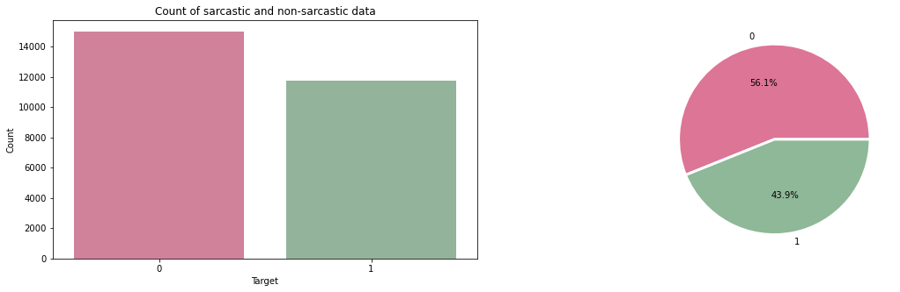
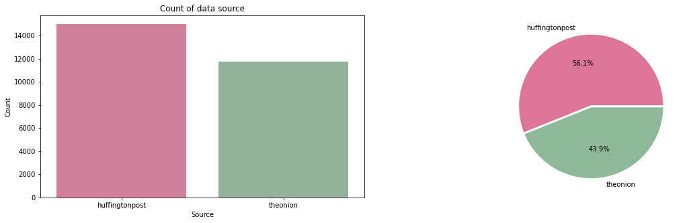
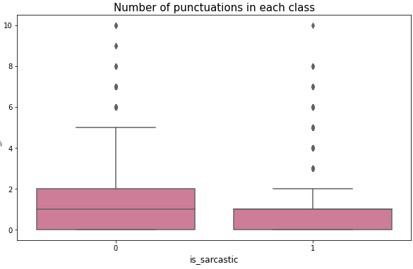
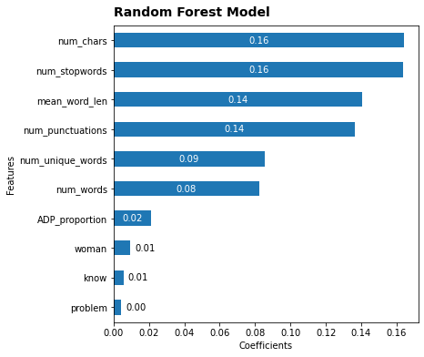
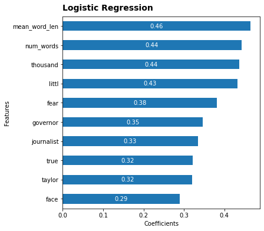
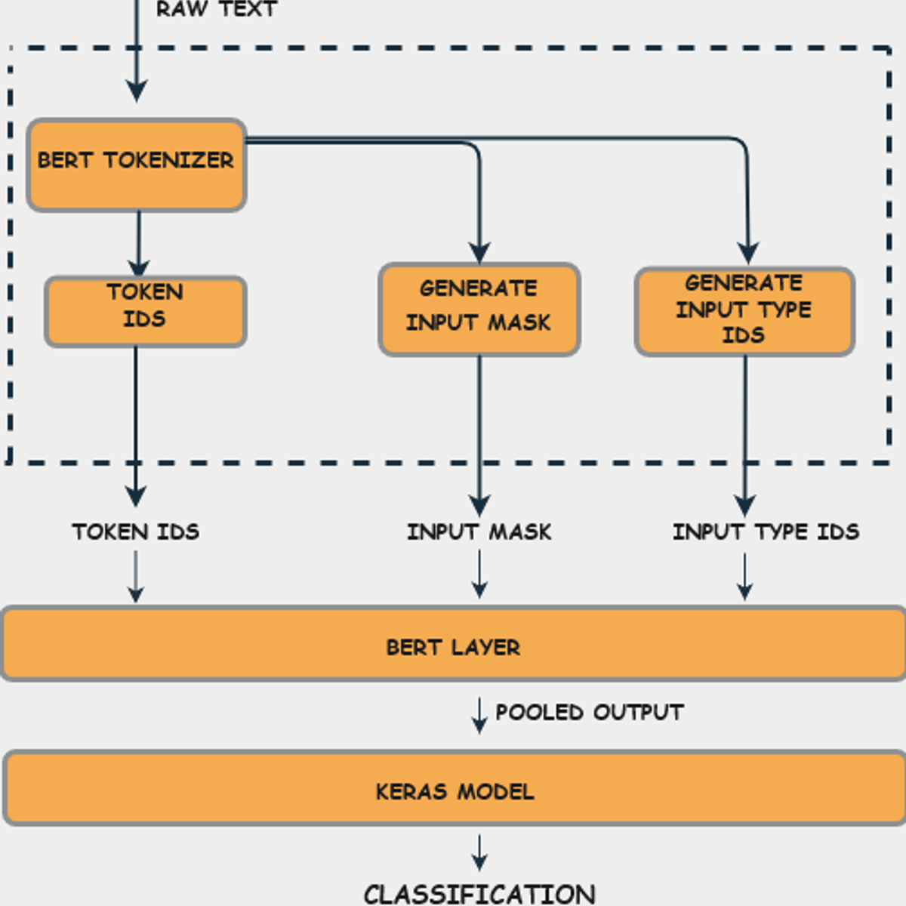

# Sarcasm Detection

## Contents
- [Executive Summary](#Executive-Summary)
- [Introduction](#Introduction)
- [Project Directory](#Project-Directory)
- [Notebook Descriptions](#Notebook-Descriptions)
- [Data Collection](#Data-Collection)
- [EDA](#EDA)
- [Data Processing and Cleaning](#Data-Processing-and-Cleaning)
- [Modeling](#Modeling)
- [Results and Conclusions](#Results-and-Conclusions)
- [Future Enhancements](#Future-Enhancements)
- [References](#References)

---

## Executive Summary

A dataset consisting of news headlines was used to model in this project. There are two sources of the headlines-theonion and huffingtonpost. Since these are written by professionals, spelling errors are likely to be very less. Theonion is known for their sarcastic headlines here too all sarcastic headlines came from theonion and rest came from huffingtonpost. An exploratory data analysis was done on the dataset and certain new metafeatures were created to be used for 
modeling. Then the headlines were vectorized and then used in two models namely-RandomForestClassifier and Logistic regression. The scores for classical ML methods are quite low at around 62%- 65%. So PCA was used on the vectorized data before modeling to check for the possibility of better prediction accuracy. However, not much was achieved in this process. This is because these methods are not accounting for the context in the text. So using a method which takes into account the context would likely give better accuracy scores. So I implemented a basic BERT model. BERT is bidirectional and this characteristic allows the model to learn the context of a word based on all of its surroundings. BERT produced best scores among all models. So it is recommended as the production model.

---


## Introduction

Sarcasm detection is a very specialized study subject in NLP, a type of sentiment analysis where the focus is on recognizing sarcasm rather than detecting a sentiment throughout the entire spectrum. As a result, the goal of this field is to determine whether or not a particular text is sarcastic.
    
The first issue we have is that, unlike sentiment analysis, where sentiment categories are clearly defined , the limits of sarcasm are not so well defined. It's also critical to understand what sarcasm is before attempting to detect it.
    
[Cambridge dictionary](https://dictionary.cambridge.org/us/dictionary/english/sarcasm) defines it as: 
>the use of remarks that clearly mean the opposite of what they say, made in order to hurt  someone's feelings or to criticize something in a humorous way.
    
Sarcasm is subjective. Non-native speakers/readers may not get it. So it is a use case for sarcasm detection and was my motive to take up this project.

---

## Project Directory
```
project-2
|__ code
|   |__ 01_EDA and Preprocessing of headlines.ipynb
|   |__ 02_Vectorization(NLP).ipynb
|   |__ 03_Model-Building_Select_K_Best.ipynb
|   |__ 04_Model_Building_with_PCA.ipynb
|   |__ 05_BERT.ipynb
|__ images
|   |__ countofsarcastic.png
|   |__ source.png
|   |__ countofpunctuation.png
|   |__ rfselectkbest.jpg
|   |__ logisticregselectkbest.png
|   |__ BERTexplained.png
|   |__ prompt_2_output.png
|__ data
|   |__ Sarcasm_Headlines_Dataset.json
|   |__ Preprocessed_headlines.csv
|   |__ Vectorized_Data.csv
|   |__ PCA_All_Data.csv
|__ presentations
|    |__capstone_presentation.pdf
|__ README.md

```
---

## Notebook Descriptions

- 01_EDA and Preprocessing of headlines.ipynb : Carried out EDA and preprocessing in this notebook
- 02_Vectorization(NLP).ipynb : vectorised the preprocessed headlines in this notebook using CountVectorizer()
- 03_Model-Building_Select_K_Best.ipynb : Modeled randomforestclassifier and logistic regression algorithm on the processed data in this notebook by slecting top  100 features
- 04_Model_Building_with_PCA.ipynb : Modeled randomforestclassifier on data in this notebook after transforming it with PCA
- 05_BERT.ipynb : implemented a basic BERT model in this notebook

**Software Recommendations**
Pandas, Plotly,nltk, Sci-Kit Learn, Numpy, MatPlotLib, Seaborn,Keras

---

## Data Collection

I am going to the news headlines dataset for this task which was found on Kaggle https://www.kaggle.com/datasets/rmisra/news-headlines-dataset-for-sarcasm-detection.
Each record consists of three attributes:

- `is_sarcastic`: 1 if the record is sarcastic otherwise 0
- `headline`: the headline of the news article
- `article_link`: link to the original news article. Useful in collecting supplementary data

---

## EDA

It was found that the dataset is fairly balanced but not perfectly balanced so we will need to stratify for target as seen in the following graph.



There were no nulls in the initial dataset and there were 36599 unique words and 262972 number of words.So, the average word count came out to be around 7. 

Also all the sarcastic headlines came from theonion and non-sarcastic headlines came from huffington post as seen below.



Then some metafeatures were created to capture information about text namely, `num_words`, `num_unique_words`, `num_chars`, `num_stopwords`, `num_punctuations` and `mean_word_len`. It was found that number of punctuations had significant difference between two classes of target as seen below. Non-sarcastic text had more punctuations.



It was quite contrary to expectations of finding more punctuations in sarcastic text, which suggests that in professional writing sarcasm is expressed through wordplay rather than punctuation, hence context would be really important for prediction.

---

## Data Processing and Cleaning

The data to be processed is textual. Various NLP libraries were used to process the data namely,
- [spaCy](https://spacy.io/): most of the processing (extracting important words, word vectorization/embedding)
- [Regex](https://docs.python.org/3/library/re.html): removing punctuation, single letters, multiple spaces etc
- [nltk](https://www.nltk.org/): removing stopwords, tokenizing
- [Sci-kit learn](https://scikit-learn.org/): CountVectorizer

spaCy had POS(Parts of Speech) functionality to offer, which was used to create metafeatures representing the proportions of various POS in a sentence. 
Regex was used to find patterns of text and remove numbers, single letters, multiple spaces among others as also to remove negations of words.
Text was stemmed using SnowballStemmer and lemmatized using nltk library functions. 
After preprocessing, text was vectorized using CountVectorizer functionality of sklearn library. After this most common words in overall data, sarcastic and non-sarcastic headlines as also the bigrams and trigrams in the three sets of data categories.

---

## Modeling

Top 100 features were selected and used to model. Two models were run-Random Forest Classifier and Logistic Regression, as this being a classification problem. The top features for Random Forest Classifier are as follows:



The top features for Logistic Regression Classification are as follows:



The accuracy was found to lie wihin 60%-66% which is 4 to 10% higher than the baseline of 56%.

PCA could be a useful tool for feature selection and processing. hence it was used to see whether there is any improvement. there was none unfortunately. Infact it performed worse than the two models earlier.

As discussed earlier, prediction of sarcasm is very contextual. Hence a model which can take into account the context of the text is likely to perform better. So a BERT model was attempted.

> BERT’s key technical innovation is applying the bidirectional training of Transformer, a popular attention model, to language modelling. This is in contrast to previous efforts which looked at a text sequence either from left to right or combined left-to-right and right-to-left training. 

The process can be visualised as in the following image.



The resulting accuracy was around 77% after 5 epochs, which is 18% higher than the baseline, which is a significant improvement.

---
 
## Results and Conclusions

1. Baseline is at around 56%.
2. RandomForestClassifier gave an accuracy of 65%
3. Logistic regression gave an accuracy of 63%
4. num_punctuations as identified earlier was an important predictor of sarcasm level of a text. There were more punctuations used in non-sarcastic text compared to sarcastic text.
5. BERT model is contextual and hence apt for text classification and performed best among the models in this project.
6. PCA is not really useful for sarcasm detection task task.

---

## Future Enhancements

I would like to explore more and better deep learning methods more to increase the prediction accuracy and work on generalizing the results to any text. There are various BERT implementations possible, it would be worthwhile to use them for this project. For example, there is a fast encoder possible which enhances the speed of model.

---

## References

1. https://medianism.org/2015/01/08/sarcasm-marks-we-dont-do-no-stinking-sarcasm/m
2. https://towardsdatascience.com/bert-explained-state-of-the-art-language-model-for-nlp-f8b21a9b6270    
3. https://www.analyticsvidhya.com/blog/2021/12/text-classification-using-bert-and-tensorflow/ 
4. https://towardsdatascience.com/multi-label-text-classification-using-bert-and-tensorflow-d2e88d8f488d


